# LucaHome-WPFApplication

Part of the LucaHome-Project

WPF client to remotely control sockets, view temperature and more of your home.

Only perfect with https://github.com/LucaHome/LucaHome-RaspberryServer

# Screenshots

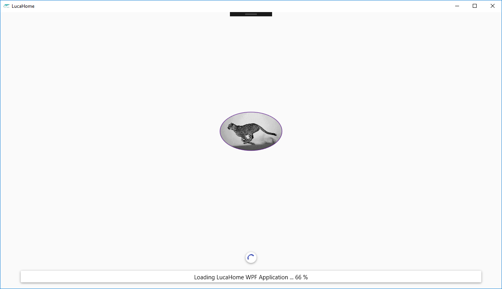
___________
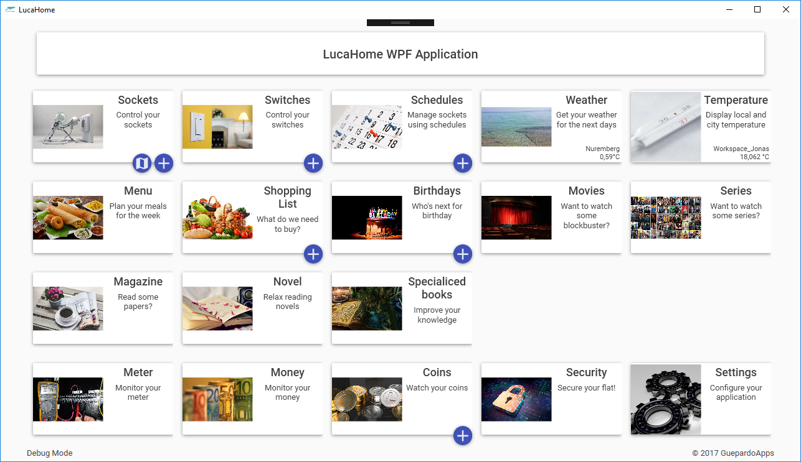
___________
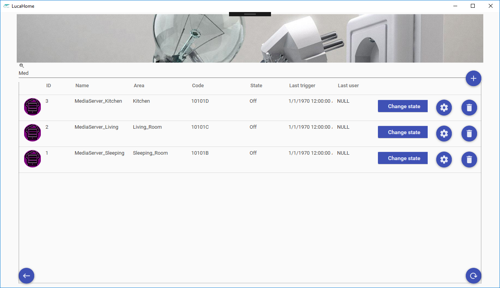
___________
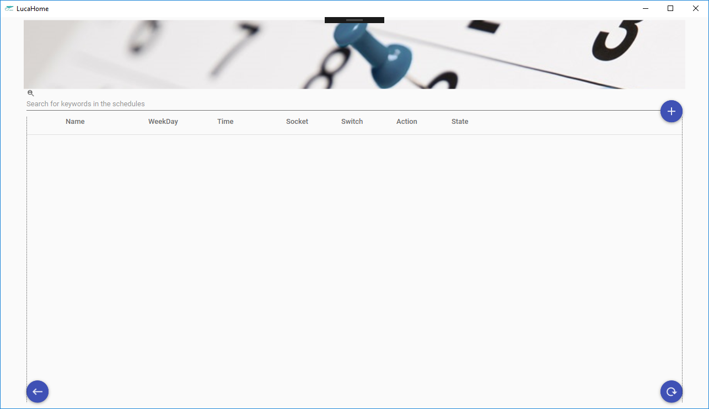
___________
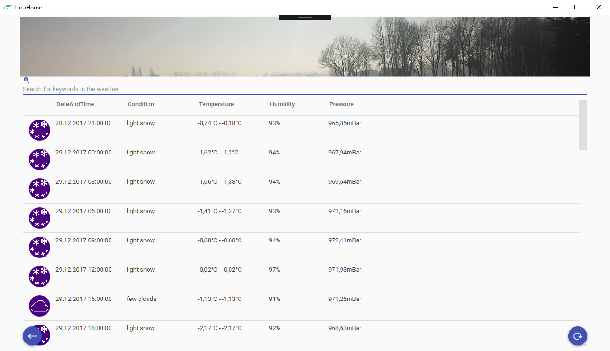
___________
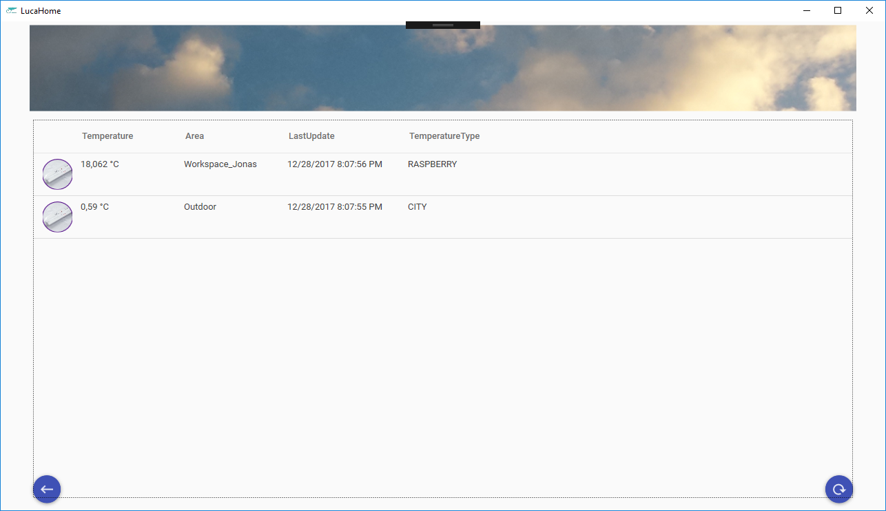
___________
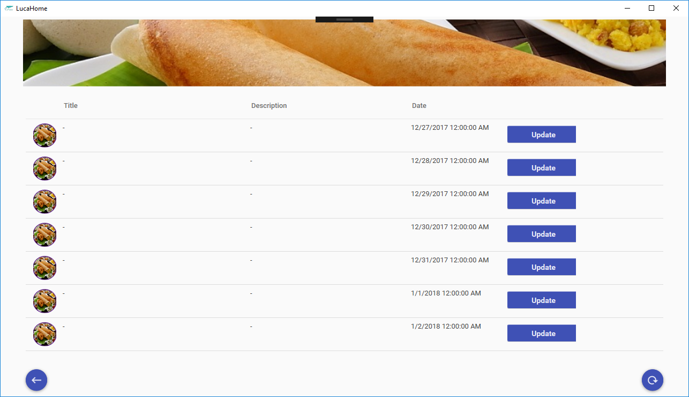
___________
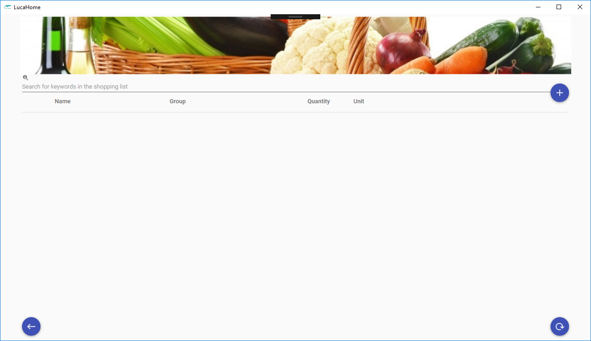
___________
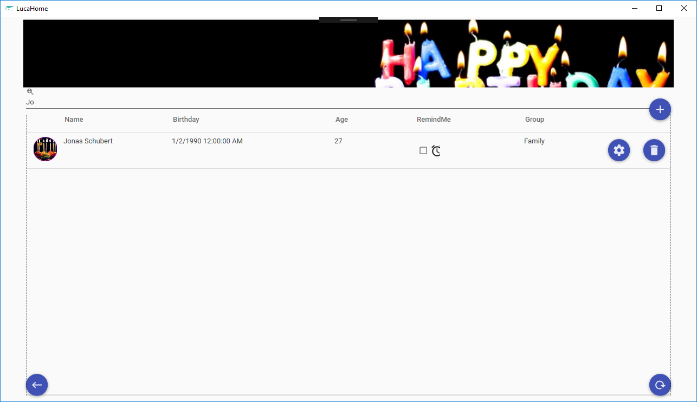
___________
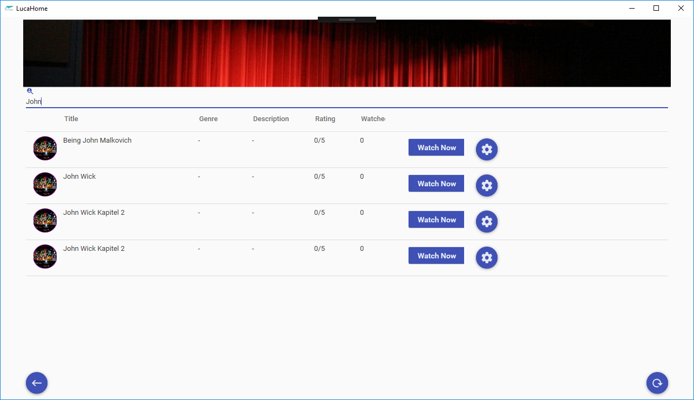
___________

___________
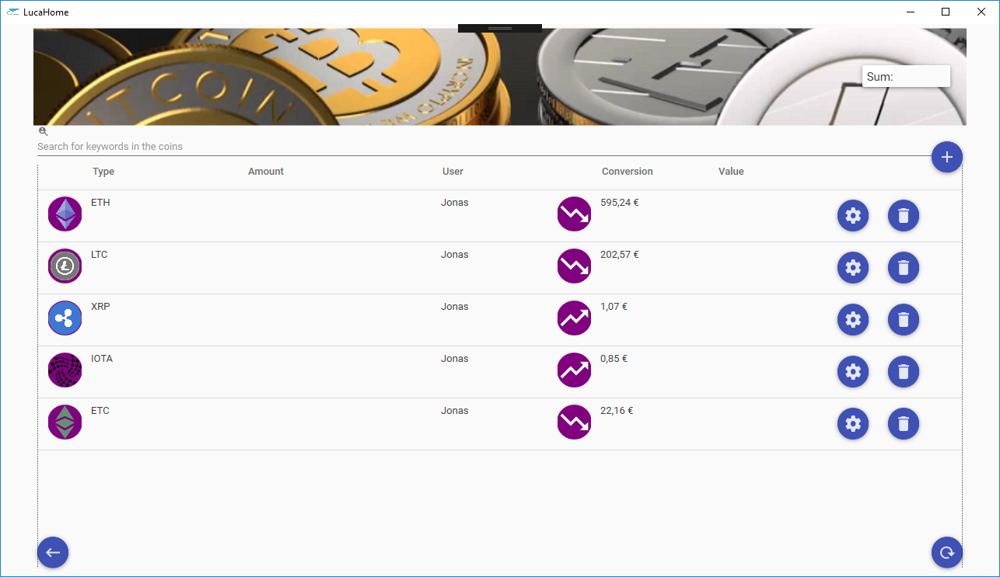
___________
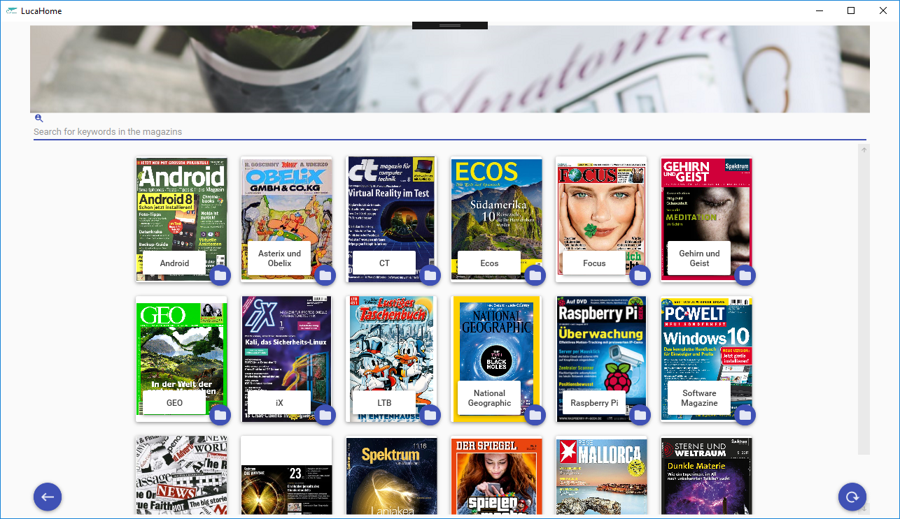
___________
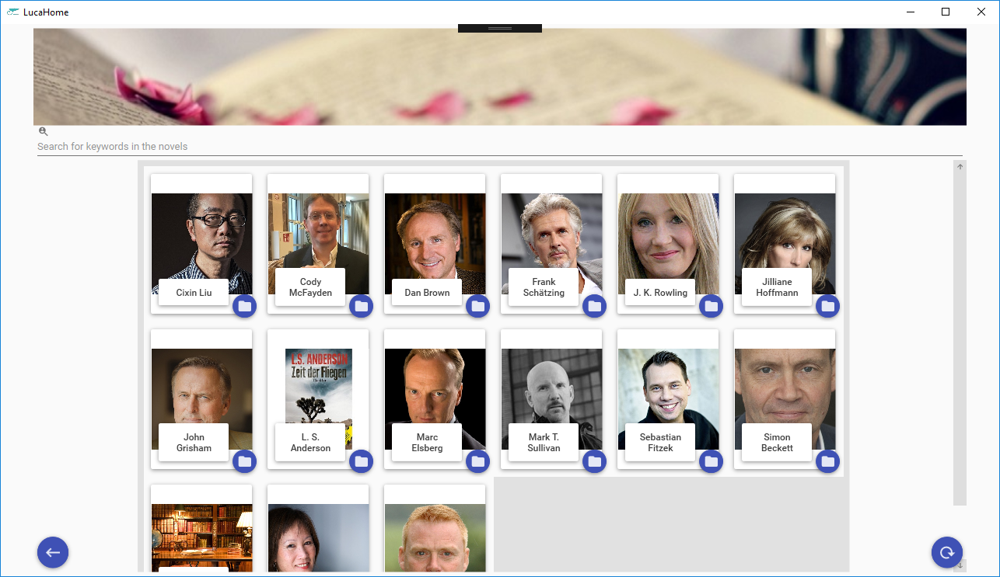
___________

___________

___________
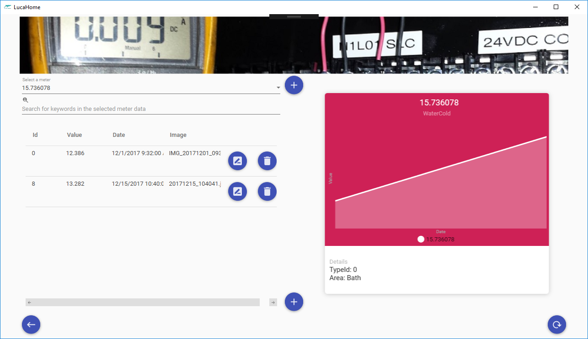
___________
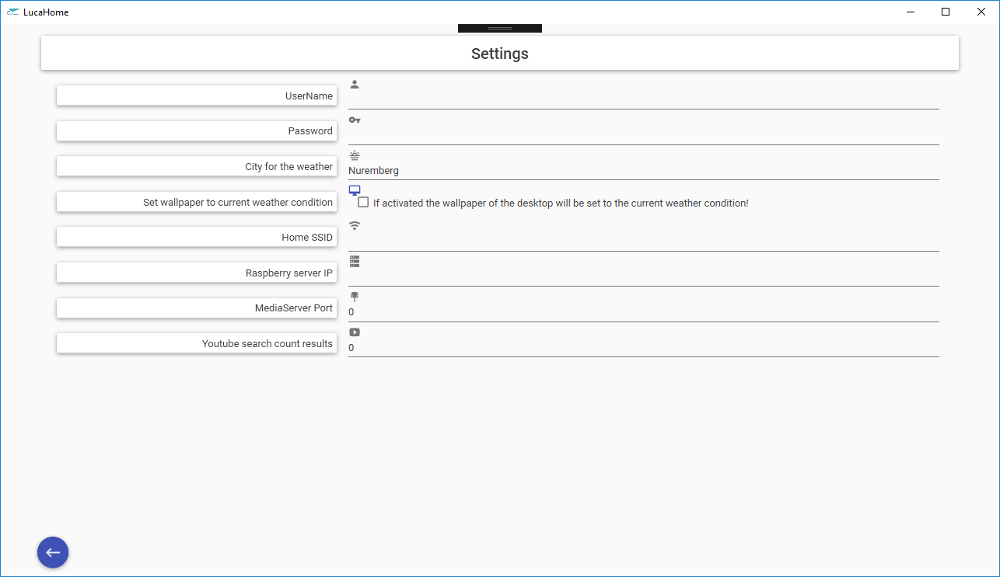

# Libraries

- [Material Design In XAML Toolkit](https://github.com/ButchersBoy/MaterialDesignInXamlToolkit)
- [ToastNotifications v2](https://github.com/raflop/ToastNotifications)
- [lvcharts](https://lvcharts.net/)

# License

LucaHome-WPFApplication is distributed under the MIT license. [See LICENSE](LICENSE.md) for details.